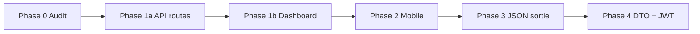

# Plan de migration — vocabulaire Frappe (fin des alias legacy)

Objectif : **une seule nomenclature** JSON (`companyId`, `branchId`, `kioskId`, `defaultShiftId`) et **routes canoniques** (`/branches`, `/kiosks`, …) — sans flag `?schema=`, sans double claim JWT, sans conservation durable de `/sites` ni `/devices`.

Références : `migration-1.2.0.md`, `roadmap-1.2.0.md`, snapshots : `frappe-json-schema.md`.

**Statut global : terminé (2026-05-21)** — déploiement coordonné API + dashboard + mobile ; reconnexion utilisateurs requise.

---

## Décisions validées (2026-05)

| Sujet | Décision |
|-------|----------|
| **JWT** | **Coupure nette** — claim `companyId` uniquement ; plus de `organizationId` dans le token ni dans `JwtUser` |
| **Événements pointage** | **`deviceId` → `kioskId`** en phase 3 (réponses + DTO création événement) |
| **Routes `/sites`, `/devices`** | **Non** — remplacer par `/branches`, `/kiosks` ; pas de période longue en parallèle |
| **Flag `?schema=frappe`** | **Non** |

**Conséquence déploiement** : release **coordonnée** API + dashboard + mobile (même fenêtre staging/prod). Pas de migration progressive où l’API garde les anciennes URLs indéfiniment.

---

## 1. État avant migration (historique)

| Couche | Ancien mécanisme |
|--------|------------------|
| **Réponses API** | Doublons `organizationId` + `companyId`, `siteId` + `branchId`, … |
| **Routes** | `/sites`, `/devices`, `/work-schedules` |
| **JWT** | Claim `organizationId` |
| **Clients** | `siteId`, `deviceId`, `scheduleId` |

---

## 2. Table de correspondance

### Champs JSON

| Legacy (v1) | Canonique (Frappe) | Modèle Prisma |
|-------------|-------------------|---------------|
| `organizationId` | `companyId` | `Company.id` |
| `siteId` | `branchId` | `Branch.id` |
| `deviceId` (événements / filtres) | `kioskId` | `TimeGateKiosk.id` |
| `scheduleId` (employé) | `defaultShiftId` | `ShiftType.id` |

### Objets imbriqués

| Legacy | Canonique |
|--------|-----------|
| `site` | `branch` |
| `device` | `kiosk` |
| `schedule` | `defaultShift` |

### Routes HTTP

| Legacy (retiré) | Canonique |
|--------------------|-----------|
| `/sites` | `/branches` |
| `/devices` | `/kiosks` |
| `/work-schedules` | `/shift-types` |

---

## 3. Phases — bilan

### Phase 0 — Audit ✅

- [x] Inventaire dashboard / mobile / api
- [x] Snapshots JSON : `frappe-json-schema.md`
- [ ] Liste kiosks déployés en prod (à valider par l’équipe ops avant release)

---

### Phase 1a — API routes canoniques ✅

- [x] `@Controller('branches')`, `@Controller('kiosks')`, `@Controller('shift-types')`
- [x] `/sites`, `/devices` → 404

---

### Phase 1b — Dashboard ✅

- [x] Types `TimeGateBranch`, `TimeGateKiosk`, champs Frappe
- [x] `timegateFetch` → `/branches`, `/kiosks`, `/shift-types`
- [x] `TimeGateAuthContext` → `companyId` depuis JWT
- [x] Formulaires employé, pointage, filtres `branchId` / `kioskId`
- [ ] Routes UI Next : `/timegate/sites` et `/timegate/devices` **conservées** (libellés UX) — renommage optionnel → `/timegate/branches`, `/timegate/kiosks`

---

### Phase 2 — Mobile kiosk ✅

- [x] Bootstrap `branches`, provision `branchId` / `kioskId`, réponse `kiosk`
- [ ] Bump version app store + note release (ops)

---

### Phase 3 — API réponses JSON canoniques ✅

- [x] Mappers sans doublons legacy en sortie
- [x] Événements / checkins : `kioskId`, relation `kiosk`
- [ ] Renommage cosmétique `toLegacyEmployeeShape` → `toApiShape` (optionnel)

---

### Phase 4 — DTO entrée + JWT ✅

- [x] DTO sans `siteId` / `organizationId` alias (sync, recalculate, pagination, employé, attendance, provision)
- [x] JWT `{ sub, email, role, companyId }`
- [x] Super-admin : param route `:organizationId` (= id company, inchangé)

---

## 4. Checklist staging (release)

- [ ] `/branches`, `/kiosks`, `/shift-types` CRUD
- [ ] `/sites`, `/devices` → 404
- [ ] Login → token avec `companyId` seulement
- [ ] CRUD employé (`branchId`, `defaultShiftId`)
- [ ] Pointage manuel : `kioskId`
- [ ] Mobile : provision + verify + heartbeat
- [ ] Recalculate timesheets / attendance days

---

## 5. Post-migration (optionnel)

| Tâche | Priorité |
|-------|----------|
| Renommer pages UI `/timegate/branches`, `/timegate/kiosks` | Basse |
| Renommer méthodes `toLegacy*Shape` en `toApiShape` | Basse |
| Tests e2e phase 27 (roadmap) | Qualité |

---

## 6. Résumé exécutif

| Livrable | Statut |
|----------|--------|
| Routes `/branches`, `/kiosks`, `/shift-types` | ✅ |
| Dashboard + mobile vocabulaire Frappe | ✅ |
| JSON sans doublons, `kioskId` événements | ✅ |
| DTO + JWT `companyId` seul | ✅ |

Pas de flag schema. Pas de double claim JWT. **Coupure nette** sur URLs et champs legacy.
