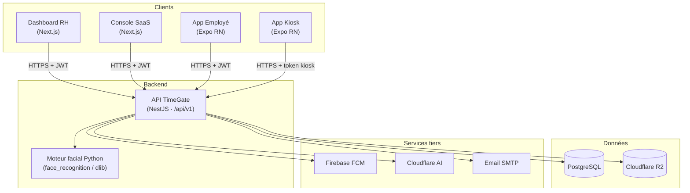
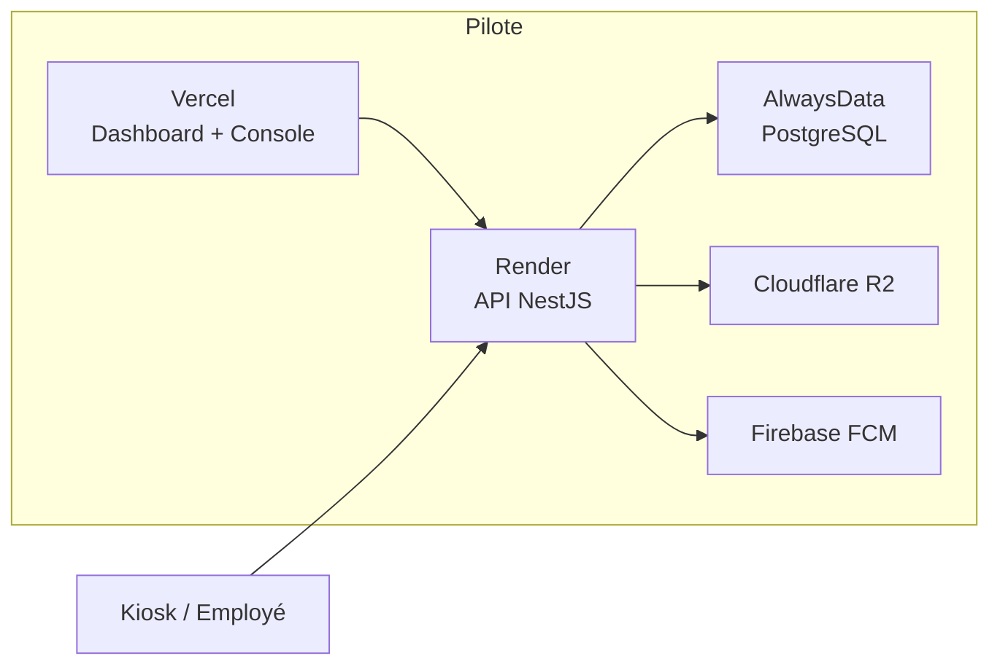
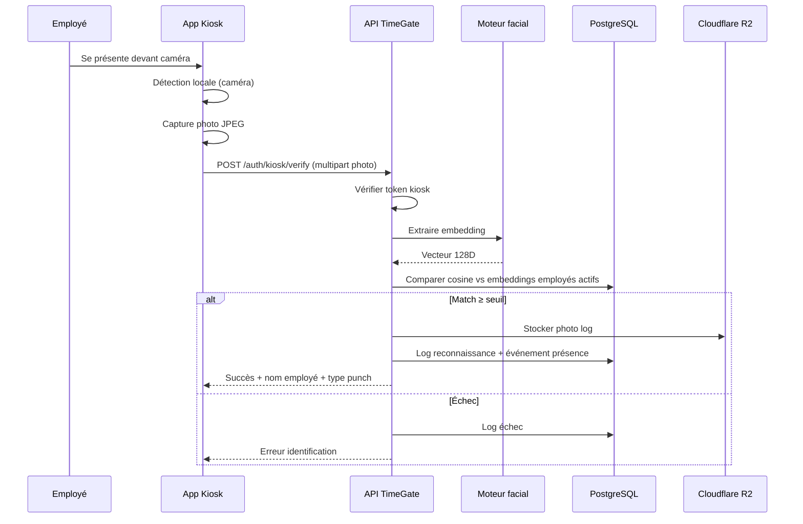
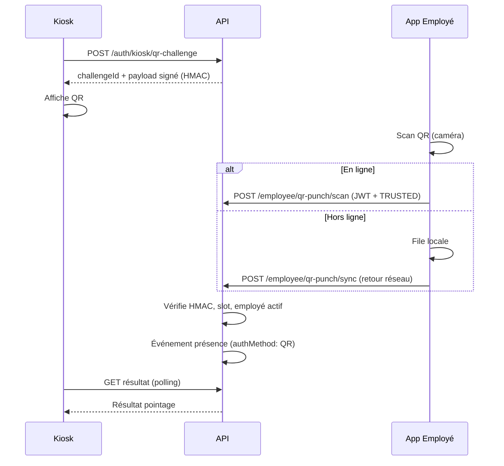
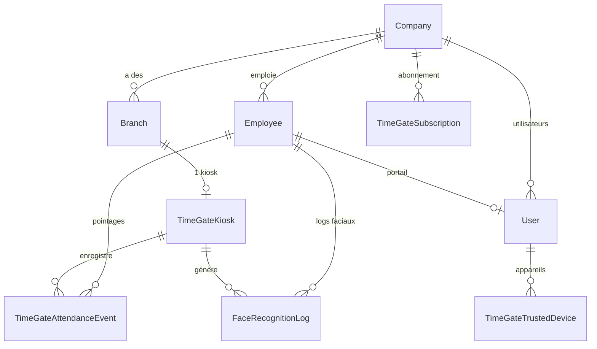
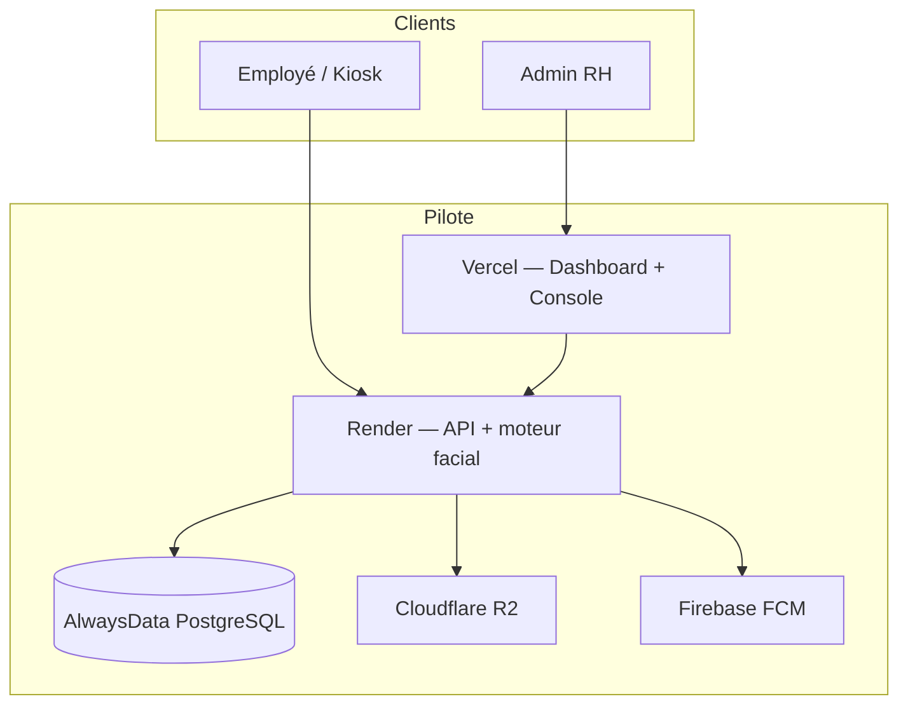
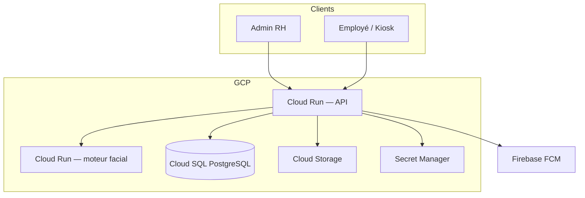

# TimeGate

## Dossier d'Architecture Technique

### AfriTech Challenge 2026

---

> **Document :** DAT technique — version 2.7  
> **Date :** 30 août 2026  
> **Porteur :** Styve Maba  
> **Contact :** kaiserstyve2@gmail.com · +242 06 515 23 74  
> **Structure :** Mazala Firm (RCCM CG-BZV-01-2021-A10-01865)  
> **Site :** [timegate-one.vercel.app](https://timegate-one.vercel.app)

---

## 1. Présentation de la solution

### 1.1 Contexte

TimeGate est une plateforme SaaS de **pointage intelligent** et de **gestion RH** destinée aux PME, industries et organisations multi-sites en Afrique centrale et au-delà. Le projet répond à un constat terrain récurrent : la gestion de présence repose encore largement sur des registres papier, des badges partagés ou des systèmes importés coûteux et peu adaptés au contexte local.

TimeGate remplace ces approches par un flux numérique simple : un smartphone ou une tablette en mode kiosk permet à l'employé de s'identifier en quelques secondes ; les événements de présence sont enregistrés côté serveur et consultables en temps réel par les équipes RH via un tableau de bord web.

**État du projet :** TimeGate est **déployé et utilisé en production pilote** — cinq applications clientes et une API documentée (Swagger). Une PME de services numériques (SSII, ~10 collaborateurs, Brazzaville) l'utilise dans le cadre d'un **pilote rémunéré** : pointage, suivi RH et congés (détail §1.6). Les **indicateurs quantitatifs et témoignages client** ne sont pas publiés dans ce document — **accord du client pilote en cours** au 30 août 2026.

### 1.2 Objectifs

| Objectif | Description |
|----------|-------------|
| Fiabiliser le pointage | Réduire la fraude (buddy punching, badges partagés) via identification biométrique ou alternatives traçables |
| Automatiser la RH | Centraliser présences, retards, absences et congés ; étendre progressivement vers planning et paie |
| Déployer sans matériel lourd | Utiliser des terminaux existants (téléphone/tablette) plutôt que des TPE dédiés coûteux |
| Multi-sites | Gérer plusieurs branches/sites sous une même organisation avec vue consolidée |
| Industrialiser en SaaS | Modèle multi-tenant avec abonnements, quotas et console plateforme |

### 1.3 Usages

1. **Pointage quotidien** — entrée, sortie, début/fin de pause via kiosk (visage, PIN, NFC ou QR).
2. **Suivi RH** — consultation des présences, retards, absences, feuilles de temps par les managers.
3. **Gestion des congés** — demandes et validations depuis le Dashboard RH ou l'App Employé.
4. **Planning et horaires** — shifts, affectations, exceptions de jour, géo-clôture optionnelle.
5. **Planning et paie** — shifts, grilles de rémunération (modules avancés ; paie **non activée** au pilote).
6. **Administration SaaS** — gestion des organisations, plans et clés d'activation via la Console SaaS.

### 1.4 Publics cibles

| Public | Application | Rôle |
|--------|-------------|------|
| Administrateur RH / Direction | Dashboard RH | Configuration, employés, kiosks, rapports, paie |
| Manager opérationnel | Dashboard RH | Suivi équipe, validations, planning |
| Employé | App Employé | Consultation pointages, congés, messages, QR punch |
| Opérateur kiosk | App Kiosk | Terminal de pointage partagé |
| Super-administrateur plateforme | Console SaaS | Gestion multi-tenant, plans, audit |
| Développeur / intégrateur | API REST `/api/v1` | Intégrations RH, paie, ERP |

### 1.5 Fonctionnalités — périmètre pilote vs roadmap

#### En production aujourd'hui (pilote SSII)

| Fonctionnalité | Détail | Usage pilote |
|----------------|--------|--------------|
| Reconnaissance faciale | Détection locale sur kiosk, vérification serveur | **Actif** — mode principal |
| Pointage PIN | PIN hashé bcrypt, saisi sur kiosk | **Actif** — secours |
| Pointage QR | Challenge rotatif kiosk ↔ scan employé | Déployé |
| Resynchronisation offline | File kiosk (visage/NFC) et App Employé (QR), fenêtre 12 h | Visage et QR ; PIN reste online |
| Dashboard RH | Présences, équipe du jour, congés, employés, kiosks | **Actif** |
| App Employé | Historique pointages, congés, notifications | **Actif** |
| Multi-tenant SaaS | Organisations, abonnements, quotas | Console TimeGate |
| Notifications push | Firebase Cloud Messaging | Alertes congés / anomalies |
| Stockage photos | Cloudflare R2 (enrollment + logs) | Enrollment + purge logs 30 j |

#### Roadmap ou modules non activés au pilote

| Fonctionnalité | Statut |
|----------------|--------|
| Pointage NFC | Implémenté ; **non déployé** (compatibilité NFC variable sur terminaux Android entrée de gamme) |
| Paie / runs de paie | Code présent ; **hors périmètre pilote** (pas de remplacement paie officielle) |
| Copilote IA manager | Prototype ; **non utilisé** en conditions réelles |
| Webhooks sortants | Configurables par organisation ; **aucun connecteur client** branché au pilote |
| Intégrations ERP / Sage / Odoo | Prévus §11 |

### 1.6 Fiche pilote — août 2026

| Indicateur | Valeur |
|------------|--------|
| **Client** | SSII services numériques (anonymisable), Brazzaville, Congo |
| **Effectif** | ~10 collaborateurs, **1 site**, **1 kiosk** (tablette) |
| **Statut commercial** | Pilote **rémunéré** — pack PRO à **25 000 FCFA/mois** (réduction exceptionnelle premier pilote ; tarif catalogue **50 000 FCFA/mois**) |
| **Matériel** | Tablette kiosk **non fournie** — appareil du client |
| **Modules déployés** | Pointage visage, PIN, QR · dashboard présences · congés · app employé |
| **Paie** | **Non activée** — hors scope pilote |
| **NFC** | **Non déployé** sur le terrain pilote |
| **Métriques & témoignages** | **Non publiés** dans ce DAT — consolidation et **accord écrit du client** en cours au 30/08/2026 |

**Indicateurs prévus** (publication après accord client) :

- Taux de succès identification visage  
- Délai médian kiosk → confirmation  
- Volume de pointages par jour ouvré  
- Satisfaction admin / direction (questionnaire simple)

Les chiffres et retours qualitatifs seront intégrés dans une prochaine version du dossier.

### 1.7 Positionnement marché (Afrique centrale)

| Alternative | Limite terrain | Apport TimeGate |
|-------------|----------------|-----------------|
| **Registre papier / Excel** | Fraude buddy punching, pas de traçabilité horaire | Pointage horodaté, anti-partage, vue manager temps réel |
| **TPE ZKTeco / bornes importées** | Coût matériel, maintenance, SAV limité localement | Kiosk sur **smartphone/tablette existante** — déploiement en heures |
| **SaaS RH importés** | Prix EUR/USD, offline faible, support distant | Tarification FCFA, **resync offline** visage/QR, support local |
| **Badge partagé** | Fraude structurelle | Identification individuelle (visage, PIN, QR) |

TimeGate ne prétend pas remplacer un ERP complet au stade pilote : la **preuve terrain** porte sur le **pointage fiable** et le **suivi RH opérationnel** (présences, congés).

### 1.8 Souveraineté des données et latence (transparence)

| Donnée / service | Localisation actuelle (pilote) | Remarque |
|------------------|-------------------------------|----------|
| Base PostgreSQL | AlwaysData (Union européenne) | Embeddings faciaux et événements de présence |
| API + moteur facial | Render (États-Unis / UE selon région) | Requêtes depuis Brazzaville |
| Photos enrollment / logs | Cloudflare R2 | Stockage objet |
| Frontends web | Vercel (edge CDN) | Dashboard et Console |

**Conséquences pour le terrain congolais :**

- Latence API et reconnaissance faciale : **quelques secondes** en conditions réseau normales ; dégradation possible si coupure ou cold start Render.
- **Compensation produit :** files offline kiosk (visage) et employé (QR), PIN en secours online, frontends servis en edge.
- **Cible production :** Google Cloud avec région optimisée (Europe ou multi-région) — §2.5.

Le choix cloud **non africain** est volontaire (rapport qualité/prix, expérience GCP) ; une réévaluation des hébergeurs régionaux interviendra lorsque le volume clients le justifiera.

---

## 2. Architecture globale

### 2.1 Vue d'ensemble

TimeGate est organisé en **monorepo** : cinq applications clientes et une API centrale, chacune déployée indépendamment.

### 2.2 Composants

| Composant | Technologie | Responsabilité |
|-----------|-------------|----------------|
| **API TimeGate** | NestJS 10, Bun, Prisma 7 | Logique métier, auth, pointage, RH, SaaS |
| **Dashboard RH** | Next.js 15, NextAuth v5 | Backoffice admin/manager tenant |
| **Console SaaS** | Next.js 15, NextAuth v5 | Administration plateforme (SUPER_ADMIN) |
| **App Kiosk** | Expo ~55, React Native | Terminal pointage (visage/PIN/NFC/QR) |
| **App Employé** | Expo ~57, React Native | Portail self-service employé |
| **Moteur facial** | Python, face_recognition | Extraction embeddings 128D |
| **Base de données** | PostgreSQL 16 | Persistance multi-tenant |
| **Object storage** | Cloudflare R2 (SDK S3) | Photos enrollment + logs reconnaissance |

### 2.3 Flux de communication

Toutes les applications clientes communiquent avec l'API via **HTTPS** et le préfixe global **`/api/v1`**.

| Client | Authentification | Protocole |
|--------|------------------|-----------|
| Dashboard RH / Console SaaS | JWT Bearer (session NextAuth → access token API) | REST JSON |
| App Employé | JWT Bearer (SecureStore) + identifiant appareil | REST JSON |
| App Kiosk | JWT longue durée (type mobile_device) | REST JSON + multipart (photos) |
| Kiosk temps réel | SSE `GET /auth/kiosk/events` | Server-Sent Events |

L'API expose une documentation **Swagger/OpenAPI** à `/api/v1/docs`.

### 2.4 Architecture applicative

L'API NestJS est structurée en **modules fonctionnels** couvrant l'ensemble du domaine métier :

- **Cœur identité :** authentification, utilisateurs, employés
- **Pointage :** présences, feuilles de temps, reconnaissance faciale, kiosks, réclamations
- **RH :** congés, absences, retards, départements, fonctions
- **Planning :** horaires, affectations de shifts, planning, jours ouvrés
- **Paie :** runs de paie, groupes de paie, grilles de rémunération, compensation employé
- **SaaS :** abonnements, plans, organisations, administration plateforme, journaux d'audit
- **Support :** notifications, appareils, appareils de confiance, messages, webhooks (copilote IA : prototype)

**Guards globaux** (appliqués à toutes les routes sauf routes publiques) :

1. Validation JWT Passport
2. Contrôle des rôles
3. Vérification de l'état d'abonnement (blocage si expiré/suspendu)

**Guards complémentaires** par route : accès opérationnel tenant, portail employé, appareil de confiance.

### 2.5 Architecture de déploiement

L'hébergement **actuellement en service** (pilote et premiers clients) repose sur une stack **provisoire**, choisie pour limiter les coûts fixes et accélérer la mise en production. La **cible production** est une infrastructure **Google Cloud**, maîtrisée par l'équipe et dimensionnée pour la montée en charge.

#### Phase actuelle — pilote (provisoire)

| Composant | Hébergement actuel | Rôle |
|-----------|-------------------|------|
| Dashboard RH | Vercel | Frontend pilote |
| Console SaaS | Vercel | Administration plateforme |
| API TimeGate | Render | API + moteur facial |
| PostgreSQL | AlwaysData | Base pilote |
| Photos | Cloudflare R2 | Stockage objets |
| Push | Firebase FCM | Notifications |
| Apps mobiles | EAS Build | Distribution iOS/Android |

Cette configuration suffit au **pilote SSII (~10 collaborateurs)** et aux premiers déploiements à faible volume.

#### Cible production — Google Cloud

| Composant | Service GCP envisagé | Rôle |
|-----------|---------------------|------|
| API TimeGate | Cloud Run (ou GKE) | API NestJS, scaling automatique |
| Moteur facial | Cloud Run dédié | Subprocess Python isolé, montée en charge indépendante |
| PostgreSQL | Cloud SQL | Base managée, sauvegardes automatisées |
| Photos | Cloud Storage | Enrollment et logs de reconnaissance |
| Secrets & config | Secret Manager | Gestion centralisée des credentials |
| CI/CD | Cloud Build + Artifact Registry | Pipeline production |
| Monitoring | Cloud Logging / Monitoring | Observabilité et alertes |

Les frontends web (Dashboard RH, Console SaaS) pourront rester sur Vercel ou être migrés vers Firebase Hosting / Cloud Run selon le rapport coût/simplicité au moment de la bascule.

#### Choix d'hébergement et latence

Le produit est **conçu pour le terrain africain** (offline partiel, modes de pointage multiples), mais l'infrastructure cloud **n'est pas hébergée localement en Afrique** à ce stade. Ce choix est **volontaire** :

- **Rapport qualité/prix** — les offres cloud africaines ou régionales spécialisées n'offrent pas, à budget équivalent, le même niveau de services managés (base, run, stockage, monitoring) que Google Cloud.
- **Maîtrise opérationnelle** — l'équipe dispose d'une **expérience confirmée sur Google Cloud** ; la montée en charge production s'appuie sur un stack déjà connu plutôt que sur des plateformes où l'exploitation reste à consolider.
- **Compensation latence** — files offline kiosk et employé, cache edge des frontends, et sélection ultérieure d'une **région GCP** (Europe ou multi-région) optimisée pour les clients Afrique centrale.

La migration vers GCP interviendra **après validation commerciale du pilote**, lorsque le volume clients justifiera un investissement infrastructure durable.

---

## 3. Fonctionnement technique

### 3.1 Authentification

TimeGate gère **plusieurs profils d'authentification** distincts :

#### Administrateurs et managers (Dashboard RH / Console SaaS)

1. L'utilisateur saisit email/mot de passe + SKU organisation.
2. `POST /auth/login` valide les credentials (bcrypt) et retourne un **JWT access token** + **refresh token opaque** (48 octets aléatoires).
3. Seul le **hash SHA-256** du refresh token est persisté en base.
4. NextAuth (Credentials provider) stocke l'access token en session cookie.
5. Chaque requête API embarque `Authorization: Bearer <jwt>`.
6. Rotation refresh via `POST /auth/refresh` : invalidation de l'ancien hash, émission d'un nouveau couple.
7. Durée access token : variable `JWT_EXPIRES_IN` (défaut 8 h). Durée refresh : `JWT_REFRESH_EXPIRES_IN` (défaut 30 jours).

**Validation JWT :** le serveur recharge l'utilisateur depuis PostgreSQL et utilise le `companyId` en base plutôt que celui du payload JWT.

#### Employés (App Employé)

1. `POST /auth/employee/identify` — découverte par email.
2. `POST /auth/employee/login` — mot de passe + identifiant appareil.
3. Enregistrement/mise à jour d'un appareil de confiance (état PENDING ou TRUSTED).
4. JWT employé ; actions sensibles (QR punch) bloquées tant que l'appareil n'est pas TRUSTED.

#### Kiosks (App Kiosk)

1. **Bootstrap :** `POST /auth/kiosk/bootstrap` — admin/manager s'authentifie sur l'appareil.
2. **Provisionnement :** `POST /auth/kiosk/provision` — sélection branche, émission d'un **JWT longue durée**.
3. Seul le **hash SHA-256** du token est stocké en base.
4. Chaque requête kiosk porte le Bearer token ; le serveur recompte le hash et vérifie l'état actif.

#### Super-administrateur plateforme

- Compte plateforme distinct des utilisateurs tenant.
- Accès réservé à la Console SaaS (rôle PLATFORM_ADMIN).

### 3.2 Gestion des utilisateurs

| Entité | Usage |
|--------|-------|
| Utilisateur tenant | Login Dashboard RH, rôles ADMIN / MANAGER / EMPLOYEE |
| Employé RH | Fiche métier, embeddings faciaux, PIN, badge NFC |
| Opérateur plateforme | Console SaaS |
| Lien employé ↔ login | Portail employé |

**Multi-tenant :** chaque entité métier porte un identifiant organisation. Chaque service applique le scoping explicitement via des contrôles d'accès et des filtres par organisation.

**Rôles tenant :**

- **ADMIN** — accès complet organisation
- **MANAGER** — accès opérationnel : équipe du jour, présences, congés, validations (périmètre organisation ; filtrage par branche en cours de généralisation)
- **EMPLOYEE** — portail employé uniquement

### 3.3 Gestion des appareils

TimeGate distingue **trois types d'appareils** :

#### 1. Kiosks

| Étape | Mécanisme |
|-------|-----------|
| Création | Admin crée un kiosk lié à une branche (1 kiosk / branche) |
| Provisionnement | JWT lifetime → hash SHA-256 en base |
| Identification | Bearer token sur chaque appel mobile |
| Heartbeat | `POST /auth/kiosk/heartbeat` → dernière activité, statut ONLINE |
| Révocation | Réinitialisation accès ; notification SSE au kiosk |
| Réactivation | Re-provisionnement admin requis |

#### 2. Appareils de confiance employé

| Étape | Mécanisme |
|-------|-----------|
| Enregistrement | Identifiant appareil UUID généré localement |
| Approbation | Admin valide l'appareil |
| États | PENDING, TRUSTED, REVOKED |
| Usage | Requis pour QR punch et actions sensibles |

#### 3. Appareils push

- Enregistrement token FCM : `POST /devices/register`
- Utilisé par Dashboard RH (Firebase web) et App Employé

### 3.4 Processus de pointage

#### Diagramme de flux — pointage facial (kiosk)

#### Résolution du type de punch

Après identification :

1. Vérifie la **géo-clôture** si coordonnées fournies.
2. Consulte les fenêtres horaires autorisées (shift/planning).
3. Détermine le type : CHECK_IN, CHECK_OUT, BREAK_START, BREAK_END, ou REJECTED.
4. Persiste un événement de présence.
5. Si accepté, matérialise l'enregistrement journalier.

#### Autres modes de pointage

| Mode | Endpoint | Particularités |
|------|----------|----------------|
| PIN | `POST /auth/kiosk/verify-pin` | Hash bcrypt ; nécessite connexion en direct |
| NFC | `POST /auth/kiosk/verify-nfc` | Lookup badge UID ; synchronisable offline |
| QR | Challenge kiosk → scan employé | Challenge + scan sur appareil de confiance |
| App Employé | `POST /employee/break-resume` | Pointage mobile, appareil de confiance requis |

#### Synchronisation offline (périmètre réel)

TimeGate **ne prétend pas être offline-first** : l'administration, l'enrollment facial et le PIN requièrent une connexion. En revanche, le **pointage peut être bufferisé** en conditions de connectivité limitée :

**App Kiosk — file visage/NFC**

| Aspect | Comportement |
|--------|--------------|
| Modes concernés | Reconnaissance faciale et badge NFC |
| Stockage local | Photos JPEG et identifiants badge en file locale |
| Synchronisation | Rejeu automatique à la reconnexion avec horodatage et clé d'idempotence |
| Politique serveur | Paramétrable par organisation ; fenêtre de validité (défaut 12 h) |
| Anti-doublon | Clé d'idempotence + contrainte unique en base |

**App Employé — file QR**

| Aspect | Comportement |
|--------|--------------|
| Modes concernés | Scan QR du challenge kiosk |
| Stockage local | Payload scanné en stockage sécurisé |
| Synchronisation | `POST /employee/qr-punch/sync` à la reconnexion |
| Prérequis | JWT employé + appareil TRUSTED |

Le pointage PIN requiert une connexion en direct au serveur pour la vérification du code.

#### Scénarios d'erreur principaux

| Scénario | Comportement |
|----------|--------------|
| Token kiosk révoqué | 401 ; notification SSE |
| Aucun visage détecté (local) | Blocage avant envoi |
| Aucun match facial | Log échec, message kiosk |
| Hors fenêtre horaire | Event REJECTED ou REVIEW_REQUIRED |
| Hors géo-clôture | Rejet avec raison |
| Abonnement suspendu | Blocage des écritures |
| Timeout moteur facial | Erreur serveur ; délai configurable |

### 3.5 Reconnaissance faciale

| Aspect | Détail |
|--------|--------|
| **Exécution reconnaissance** | Serveur API (comparaison côté serveur) |
| **Détection locale kiosk** | Caméra native — présence et qualité du visage uniquement |
| **Bibliothèque serveur** | Python face_recognition (dlib) |
| **Format embedding** | Vecteur 128 dimensions, stocké JSON en base |
| **Seuil de match** | Similarité cosinus ≥ `FACE_VERIFY_THRESHOLD` (défaut 0,82) |
| **Algorithme** | Similarité cosinus — parcours **linéaire** des employés actifs avec embedding |
| **Limite actuelle** | Adapté au pilote (~10–50 employés/org.) ; au-delà, latence matinale croissante |
| **Piste montée en charge** | Service facial dédié (Cloud Run), index vectoriel (pgvector), pré-filtrage par branche |
| **Données transmises** | Photo JPEG multipart (max 12 Mo) |
| **Données stockées** | Embedding JSON, photo enrollment (R2), photos logs (R2) |
| **Enrollment** | `POST /face/enroll` (rôle ADMIN) → embedding + upload R2 |
| **Logs** | Trace vérification (succès, confidence, photo, horodatage) |
| **Purge photos logs** | Cron quotidien — suppression R2 après durée configurable (défaut 30 jours) |

**Accès aux données biométriques :**

- Enrollment et consultation : routes protégées, rôle ADMIN requis.
- Logs reconnaissance : filtrés par organisation.
- Comparaison lors du pointage : exécutée côté serveur, embeddings non exposés au kiosk.

### 3.6 PIN / NFC / QR

#### PIN

- **Configuration :** attribution PIN par employé — hash bcrypt, minimum 4 caractères.
- **Vérification :** `POST /auth/kiosk/verify-pin` — comparaison bcrypt, employé scopé à l'organisation du kiosk.
- **Connexion :** vérification en temps réel (connexion serveur requise).
- **Seuils d'échec :** nombre maximal de tentatives et délai de cooldown paramétrables par organisation.

#### NFC

- **Statut pilote :** implémenté dans l'App Kiosk, **non déployé** chez le client SSII (NFC absent ou peu fiable sur plusieurs terminaux Android locaux).
- **Configuration :** attribution UID badge par employé, unique par organisation.
- **Lecture :** module NFC natif sur App Kiosk.
- **Vérification :** `POST /auth/kiosk/verify-nfc` — lookup badge ; synchronisable via file offline.
- **Sécurité :** UID transmis sur HTTPS ; unicité organisation + possession physique du badge.

#### QR — workflow

**Confiance appareil :** le pointage QR exige un appareil employé approuvé (TRUSTED).

### 3.7 Gestion des données

- **Validation entrées :** pipe de validation global NestJS (whitelist).
- **Idempotence pointage :** header `X-Idempotency-Key`.
- **Correlation :** middleware `X-Request-Id`.
- **Upload fichiers :** limite 12 Mo sur endpoints faciaux.
- **Erreurs :** format standard (`statusCode`, `message`, `error`).

---

## 4. Choix technologiques

### 4.1 Frontend

| Technologie | Usage TimeGate | Justification |
|-------------|----------------|---------------|
| **Next.js 15** | Dashboard RH, Console SaaS | SSR/RSC, App Router, déploiement Vercel natif |
| **React 18 + TypeScript** | Frontends web | Typage fort, écosystème mature |
| **Tailwind CSS 4** | Dashboard RH, Console SaaS | Cohérence visuelle, rapidité UI |
| **NextAuth v5** | Auth session web | Intégration Credentials → JWT API |
| **Expo / React Native** | App Kiosk, App Employé | Cross-platform iOS/Android, caméra/NFC natif |
| **Expo Router** | Navigation mobile | Routing file-based cohérent |

### 4.2 Backend

| Technologie | Usage TimeGate | Justification |
|-------------|----------------|---------------|
| **NestJS 10** | API principale | Modularité, guards, DI, Swagger intégré |
| **Bun 1.3** | Runtime + package manager API | Performance, scripts unifiés |
| **Prisma 7** | ORM PostgreSQL | Migrations typées, évolution schéma tracée |
| **Passport JWT** | Authentification | Standard industrie, guards NestJS |
| **bcrypt** | Mots de passe, PIN | Hashage adaptatif |
| **Python face_recognition** | Biométrie | Bibliothèque éprouvée dlib, subprocess isolé |

### 4.3 Base de données

| Technologie | Usage TimeGate | Justification |
|-------------|----------------|---------------|
| **PostgreSQL 16** | Persistance principale | Relations complexes, JSON (embeddings), fiabilité |
| **Prisma migrations** | Évolution schéma | Traçabilité, CI automatisée |

### 4.4 APIs

- **REST JSON** sous `/api/v1`
- **OpenAPI/Swagger** : `/api/v1/docs`
- **SSE** : événements kiosk (`/auth/kiosk/events`)
- **Multipart** : upload photos pointage/enrollment

### 4.5 Infrastructure

#### Phase actuelle (pilote — provisoire)

| Composant | Service | Rôle |
|-----------|---------|------|
| Dashboard RH | Vercel | Frontend, TLS |
| Console SaaS | Vercel | Frontend plateforme |
| API TimeGate | Render | API + moteur facial |
| PostgreSQL | AlwaysData | Base pilote |
| Object storage | Cloudflare R2 | Photos |
| Push | Firebase FCM | Notifications |
| Email | SMTP | Emails transactionnels |

*(Copilote IA et webhooks avancés : modules présents, non activés au pilote.)*

#### Cible production — Google Cloud

Migration planifiée vers Cloud Run, Cloud SQL, Cloud Storage et Secret Manager, avec pipeline Cloud Build. Choix motivé par la **solidité**, le **scaling** et la **maîtrise opérationnelle** de l'équipe sur GCP — plutôt que par un hébergement cloud africain local, jugé moins favorable en rapport qualité/prix et en expérience d'exploitation à ce stade du projet.

**Environnement de développement :** PostgreSQL local, API locale, fronts locaux, base CI éphémère (GitHub Actions).

### 4.6 DevOps

| Outil | Usage |
|-------|-------|
| **GitHub Actions** | CI sur branche main |
| **Bun** | Install, build, tests API |
| **EAS** | Build/distribution apps mobiles Expo |
| **Prisma migrate deploy** | Migrations en CI et déploiement |

---

## 5. Données et architecture de stockage

### 5.1 Modèle de données

**Ancrage multi-tenant :** Organisation → Branche → Kiosk (relation 1:1 branche/kiosk).

### 5.2 Données utilisateurs

| Donnée | Stockage | Protection |
|--------|----------|------------|
| Identité (nom, email) | Utilisateur, Employé | Scoping organisation |
| Mot de passe | Hash bcrypt | Coût 10 |
| PIN kiosk | Hash bcrypt | Coût 10 |
| Rôle | Enum rôle | Guards + rechargement base |
| Appareil confiance | Appareil de confiance | Statut + approbation admin |

### 5.3 Données de présence

| Entité | Description |
|--------|-------------|
| Événement de présence | Modèle principal — type, source, statut, méthode auth, timestamps |
| Check-in employé | Enregistrement journalier matérialisé |
| Présence agrégée | Agrégat journalier |
| Feuille de temps | Calcul journalier |
| Log reconnaissance faciale | Trace vérification faciale |

**Index clés :** organisation + date, employé + date, kiosk + date.

### 5.4 Données appareils

| Modèle | Champs principaux |
|--------|-------------------|
| Kiosk | Token hashé, statut, dernière activité, flags visage/nfc/qr |
| Appareil de confiance | Identifiant appareil, plateforme, statut |
| Appareil push | Token FCM |

### 5.5 Données biométriques

| Donnée | Emplacement | Format |
|--------|-------------|--------|
| Embedding facial | Employé | JSON array 128 floats |
| Photo enrollment | Employé | URL R2 |
| Date enrollment | Employé | DateTime |
| Photos vérification | Log reconnaissance | URL R2 |

**Flux :** enrollment admin → API → embedding Python → stockage base + R2.

### 5.6 Conservation et protection

| Donnée | Conservation | Mécanisme |
|--------|--------------|-----------|
| Photos logs reconnaissance | Durée configurable, défaut 30 j | Cron quotidien — purge R2 |
| Embeddings faciaux | Durée de vie employé actif | Suppression à la suppression fiche employé |
| Photos enrollment | Liées à la fiche employé | URL R2 |
| Événements pointage | Historique complet | Base PostgreSQL |
| Isolation tenant | Par service | Contrôles d'accès organisation |
| Chiffrement transit | HTTPS | Via hébergeurs |

---

## 6. Scalabilité et performance

### 6.1 Architecture actuelle et limites connues

| Composant | Comportement actuel | Limite identifiée |
|-----------|---------------------|-------------------|
| API NestJS | Stateless (JWT) | Cold start Render en infra pilote |
| Moteur facial | Subprocess Python **sur la même instance** que l'API | Concurrence limitée ; pic matinal = risque timeout |
| Comparaison faciale | O(n) linéaire sur employés actifs | ~10 OK ; **200+ nécessite refonte** (index, service dédié) |
| PostgreSQL | Pool configurable | AlwaysData pilote — pas de réplica lecture |

L'objectif §11 (50–500 collaborateurs) **suppose** la migration GCP (Cloud Run facial isolé, instances warm, Cloud SQL dimensionné) et l'optimisation du moteur — ce n'est **pas garanti** avec l'infra pilote actuelle.

### 6.2 Optimisations existantes

| Optimisation | Détail |
|--------------|--------|
| Index DB | Index composés sur events, checkins, appareils |
| Idempotence | Évite doublons pointage (cache 10 min) |
| Détection locale kiosk | Réduit appels API inutiles (pas de photo si pas de visage) |
| Pagination | Présente sur endpoints listing |
| Validation whitelist | Rejet early des payloads invalides |

### 6.3 Capacités et trajectoire

| Phase | Effectif cible | Infrastructure | Moteur facial |
|-------|----------------|----------------|---------------|
| **Pilote (actuel)** | ~10 | Render + AlwaysData | Subprocess linéaire — suffisant |
| **PME** | 50–100 | GCP Cloud Run + Cloud SQL | Service dédié, index vectoriel |
| **Multi-sites** | 100–500 | GCP multi-instance, monitoring | ANN / pgvector, filtrage branche |

---

## 7. Interopérabilité

### 7.1 API

- **Base :** `https://timegate.onrender.com/api/v1`
- **Documentation :** Swagger UI `/api/v1/docs`
- **Auth :** Bearer JWT
- **Format :** JSON, dates ISO-8601 UTC
- **Correlation :** `X-Request-Id`

Domaines exposés : auth, employees, attendance/events, timesheets, leaves, payroll-runs, kiosks, face, notifications, system-config.

### 7.2 Services externes

| Service | Intégration |
|---------|-------------|
| Cloudflare R2 | SDK S3 |
| Firebase FCM | firebase-admin + SDK clients |
| Cloudflare AI | Copilote manager (prototype, non pilote) |
| SMTP (Nodemailer) | Emails transactionnels |

### 7.3 Intégrations

- **API REST documentée** — synchronisation employés, consultation présences (Swagger `/api/v1/docs`).
- **Webhooks sortants** — événements de présence et RH signés HMAC-SHA256 ; activation par organisation. **Aucun client pilote connecté** à ce jour ; le mécanisme est testé en interne.
- **Connecteurs ERP / paie** — roadmap §11 (Sage, Odoo, exports structurés).

## 8. Sécurité et conformité

### 8.1 Mesures de sécurité

#### Authentification

| Mécanisme | Implémentation |
|-----------|----------------|
| JWT access token | NestJS, durée configurable (défaut 8 h) |
| Refresh token opaque | 48 bytes aléatoires ; hash SHA-256 en base ; rotation |
| Kiosk token | JWT longue durée ; hash SHA-256 en base |
| Mots de passe utilisateur | bcrypt cost 10 |
| PIN kiosk | bcrypt cost 10, minimum 4 caractères |
| Validation JWT | Rechargement utilisateur depuis base ; companyId depuis base |

#### Autorisation

- Guards globaux : JWT, rôles, état abonnement
- Routes publiques explicites pour kiosk et auth
- Guard accès opérationnel : isole comptes plateforme des données tenant
- Guard appareil de confiance : QR punch bloqué si appareil non approuvé
- Super-admin isolé via modèle distinct

#### Protection des données et appareils

- CORS liste blanche (`CORS_ORIGIN`)
- Validation globale whitelist
- Secrets en variables d'environnement
- Scoping tenant par service
- Upload limité 12 Mo (photos faciales)
- Kiosk : révocation token, heartbeat, notification SSE
- Idempotence pointage via `X-Idempotency-Key`

#### Données biométriques

- Comparaison serveur ; embeddings stockés, non renvoyés au kiosk
- Purge automatique des photos de logs après durée configurable
- Routes enrollment réservées ADMIN authentifié
- Journaux d'audit lors des purges

#### Infrastructure et exploitation

- **Phase pilote :** HTTPS via Vercel et Render, PostgreSQL AlwaysData — **pas de SLA contractuel**, monitoring basique hébergeur.
- **Cible production :** Google Cloud (Cloud SQL, Cloud Run, Cloud Storage, Cloud Monitoring / Logging).
- **Roadmap sécurité opérationnelle :** alerting uptime, plan de reprise (backups Cloud SQL), procédure incident documentée, audit externe avant clients >100 employés.

### 8.2 Données personnelles et biométrie

TimeGate applique le principe de **minimisation** : seules les données nécessaires au pointage et à la gestion RH sont collectées.

#### Cadre biométrique (point de vue employeur — pilote)

| Sujet | Pratique TimeGate |
|-------|-------------------|
| **Finalité** | Pointage et contrôle d'accès horaire — pas de surveillance continue |
| **Base légale (cadre travail)** | Exécution du contrat de travail / intérêt légitime de l'employeur — **à formaliser** avec chaque client (notice employés) |
| **Consentement** | Information préalable des employés et alternative de pointage (**PIN ou QR**) — responsabilité partagée client + TimeGate |
| **Accès aux données** | ADMIN organisation ; embeddings **jamais** exposés au kiosk |
| **Durée embeddings** | Tant que l'employé est actif ; **suppression** à la suppression de la fiche employé |
| **Durée photos logs** | Purge automatique après 30 j (configurable) |
| **Registre de traitement** | Document type fourni au client pilote ; registre TimeGate en cours de structuration |
| **Droit d'opposition** | Alternative PIN/QR disponible — pas de pointage facial obligatoire |

#### Localisation et transferts

Données hébergées hors Afrique centrale (UE / US) — voir §1.8. Les clients sont informés lors de l'onboarding pilote. La cible GCP permettra de **documenter précisément** la région et les clauses de sous-traitance.

#### Isolation multi-tenant

Chaque organisation n'accède qu'à ses propres données (scoping systématique, contrôles d'accès par rôle).

---

## 9. Méthodologie de projet

### 9.1 Gestion du code et équipe

- **Git** — repository monorepo versionné
- **Branches :** CI sur main (push + pull requests)

**Équipe :**

| Rôle | Composition |
|------|-------------|
| **Porteur du projet** | Styve Maba — coordination produit, architecture ; **développeur** (1/2) |
| **Développement** | **2 développeurs expérimentés** (dont le porteur) — API NestJS, apps Expo, dashboards Next.js |
| **Design** | **1 designer UI/UX** — interfaces web (Dashboard RH, Console SaaS) et mobile (kiosk, app employé) |
| **Commercial terrain** | **1 commercial** — prospection PME, déploiement pilote, relation client et support premier niveau |
| **Support admin** | Mazala Firm |

L'équipe couvre développement, design produit et **go-to-market terrain**. La capacité de delivery est concentrée sur le **module pointage + RH opérationnel** ; modules avancés (paie, IA) en roadmap.

- **Documentation design** — spécifications fonctionnelles et kit pilote client

### 9.2 Environnements

| Environnement | Usage |
|---------------|-------|
| Local | API, Dashboard RH, Console SaaS en développement |
| CI | PostgreSQL 16 éphémère (GitHub Actions) |
| Production (pilote) | AlwaysData, Render, Vercel |
| Production (cible) | Google Cloud |
| Tests E2E | Base isolée, distincte de la production |

### 9.3 Tests

| Scope | Couverture |
|-------|------------|
| API use-cases | Auth, employees, attendance, face, NFC/QR/offline, payroll, SaaS |
| API E2E | Scénarios complets sur base isolée |
| Dashboard | Modules tour/onboarding |
| App Kiosk | États UI de scan |
| Apps mobiles (build) | **Hors CI** — builds EAS manuels ; signal de risque identifié |
| Frontend typecheck | Dashboard RH + Console SaaS en CI |

### 9.4 CI/CD

Workflow GitHub Actions :

1. **Job API :** install → migrations → build → tests use-cases
2. **Job frontend :** typecheck Dashboard RH et Console SaaS

### 9.5 Déploiement

| Composant | Méthode |
|-----------|---------|
| Dashboard RH / Console SaaS | Push Git → Vercel (pilote) |
| API TimeGate | Render (pilote) → **Google Cloud Run** (production) |
| Base de données | AlwaysData (pilote) → **Cloud SQL** (production) |
| Apps mobiles | EAS Build |

---

## 10. Maintenance et évolutivité

### 10.1 Maintenance

- Migrations Prisma versionnées
- Seed reproductible pour environnements de test
- Documentation client pilote
- Module notifications (20+ types d'événements)

### 10.2 Gestion des versions

- API versionnée par préfixe `/api/v1`
- Schema base de données versionné
- Apps mobiles : versioning via EAS

### 10.3 Évolutions fonctionnelles supportées

| Évolution | Faisabilité |
|-----------|-------------|
| Nouveau mode pointage | Enum méthode auth + endpoint + UI kiosk |
| Nouvelle organisation | Modèle multi-tenant natif |
| Nouveau site/branche | Branche + kiosk associé |
| Intégration paie tierce | API payroll + connecteur |

### 10.4 Évolutivité technique

L'architecture modulaire NestJS permet d'ajouter de nouveaux modules métier sans impact sur les clients existants. Le modèle multi-tenant supporte l'ajout d'organisations sans reconfiguration infrastructure.

---

## 11. Perspectives

TimeGate vise une croissance progressive ancrée dans des déploiements terrain réussis :

- **Consolidation pilote** — publication des métriques terrain (après accord client) et prospection 2ᵉ client PME.
- **Montée en charge** — extension à 50–100 collaborateurs avec migration **Google Cloud**, service facial dédié et index vectoriel.
- **Infrastructure production** — bascule Render/AlwaysData vers Cloud Run et Cloud SQL.
- **Connecteurs paie** — intégrations Sage, Odoo et cabinets locaux (après validation module pointage).
- **Programme partenaires** — cabinets RH et intégrateurs Afrique centrale.
- **Conformité renforcée** — registre de traitement, notice biométrique type, audit externe avant grands comptes.

---

## 12. Annexes

### Annexe A — Schémas de déploiement

**Phase pilote (actuelle)**

**Cible production (Google Cloud)**

### Annexe B — Documentation API

La documentation interactive **Swagger** est disponible à `/api/v1/docs` sur l'API de production pilote. Les intégrateurs y trouvent l'ensemble des endpoints auth, employés, présences, kiosks et face.

### Annexe C — Captures produit (pilote)

Captures août 2026 — **dashboard : données de démonstration** ; kiosk et app employé : environnement pilote SSII (Brazzaville).

| Interface | Capture | Remarque |
|-----------|---------|----------|
| **Dashboard RH** | Équipe du jour, présences, gestion employés | Jeu de données de **démonstration** |
| **App Kiosk** | Écran de pointage facial | Environnement **pilote terrain** |
| **App Employé** | Historique pointages et congés | Environnement **pilote terrain** |

*(Captures intégrées dans la version HTML/PDF du DAT — voir Annexe C visuelle.)*

---

*Document TimeGate — AfriTech Challenge 2026. Aucun secret, token ou mot de passe n'est inclus.*
